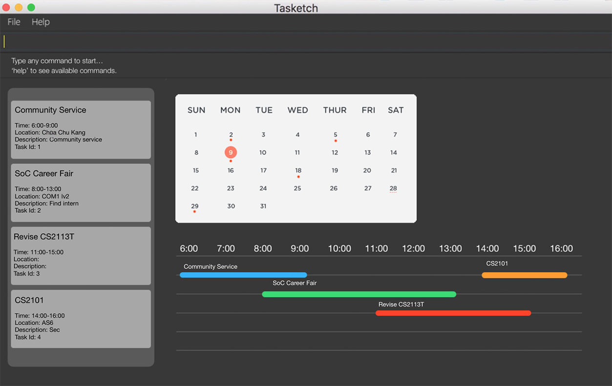

= Tasketch
ifdef::env-github,env-browser[:relfileprefix: docs/]

https://travis-ci.org/CS2113-AY1819S2-T09-2/main[image:https://travis-ci.org/CS2113-AY1819S2-T09-2/main.svg?branch=master[Build Status]]

ifdef::env-github[]
image::docs/images/Ui.png[width="600"]
endif::[]

ifndef::env-github[]

endif::[]

* Tasketch is an application that helps you to manage your daily tasks.
* Tasketch is a CLI (Command Line Interface) application with GUI output so that you can have best of the both worlds.
* Tasketch is a Java application that you can run on any machine with Java Runtime Environment installed.
* What makes Tasketch special:
** Add to-do tasks on daily basis
** List the tasks based on the order of priority
** Each task has a task_ID which helps the user to identify tasks clearly
** Write reflection for a task
** Remind users of the upcoming tasks

== Site Map

* <<UserGuide#, User Guide>>
* <<DeveloperGuide#, Developer Guide>>
* <<LearningOutcomes#, Learning Outcomes>>
* <<AboutUs#, About Us>>
* <<ContactUs#, Contact Us>>

== Acknowledgements

* This application is built on the sample application https://github.com/nusCS2113-AY1819S2/addressbook-level4[Address Book (Level 4)]
* Libraries used: https://github.com/TestFX/TestFX[TextFX], https://bitbucket.org/controlsfx/controlsfx/[ControlsFX],
 https://github.com/FasterXML/jackson[Jackson], https://github.com/google/guava[Guava], https://github.com/junit-team/junit5[JUnit5], http://opencsv.sourceforge.net/[opencsv]

== Licence : link:LICENSE[MIT]
